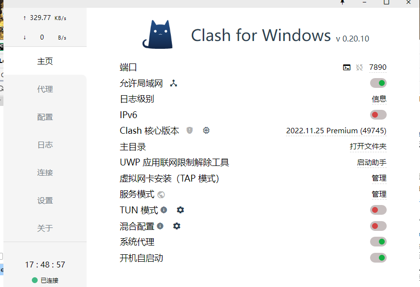
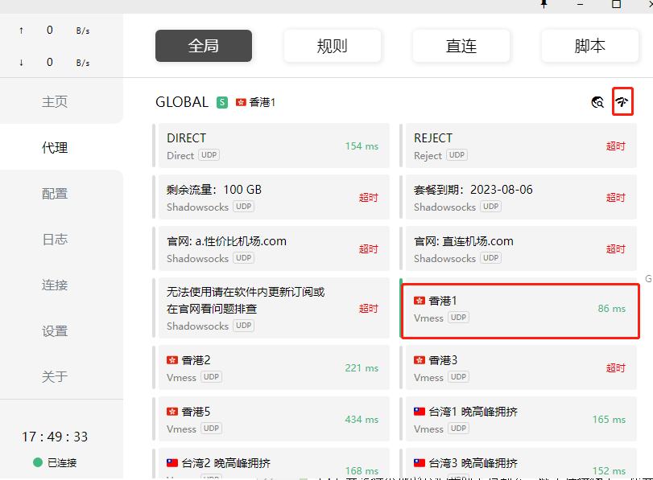
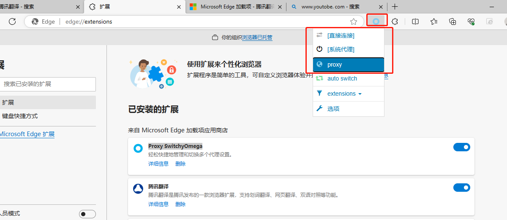
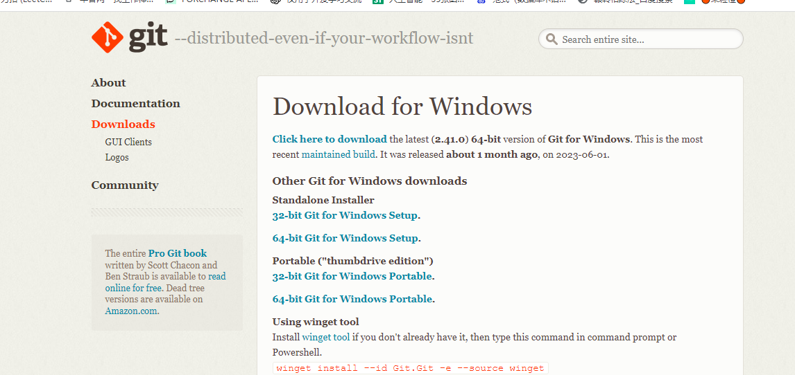
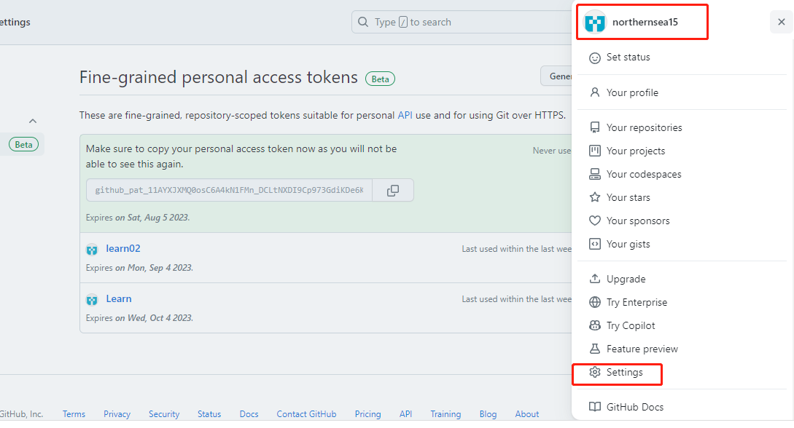
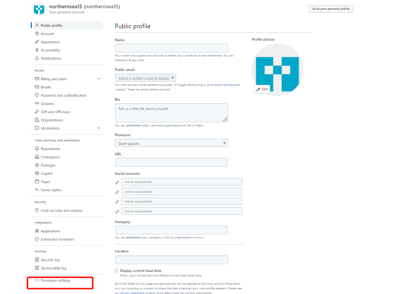
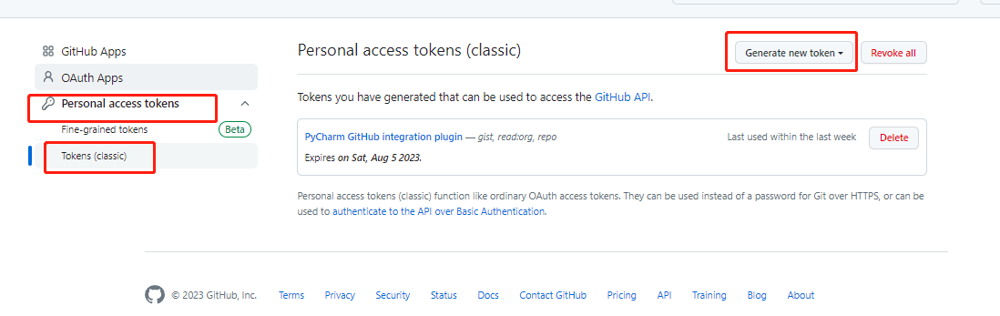
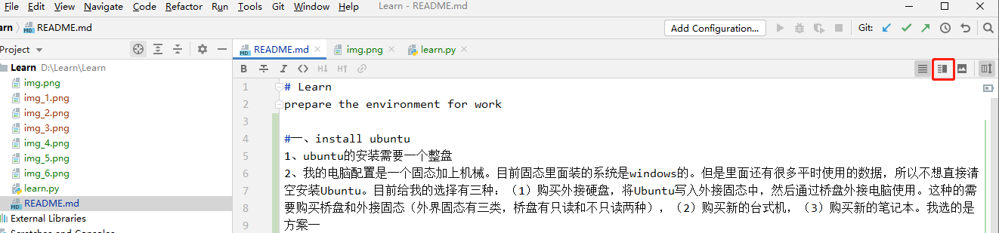
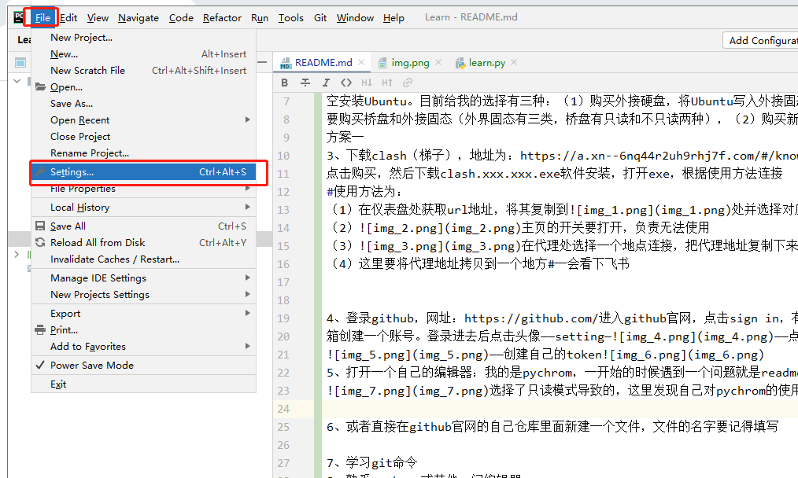

# Learn
prepare the environment for work

#一、install ubuntu
1、ubuntu的安装需要一个整盘
2、我的电脑配置是一个固态加上机械。目前固态里面装的系统是windows的。但是里面还有很多平时使用的数据，所以不想直接清
空安装Ubuntu。目前给我的选择有三种：（1）购买外接硬盘，将Ubuntu写入外接固态中，然后通过桥盘外接电脑使用。这种的需
要购买桥盘和外接固态（外界固态有三类，桥盘有只读和不只读两种），（2）购买新的台式机，（3）购买新的笔记本。我选的是
方案一
3、下载clash（梯子），地址为：https://a.xn--6nq44r2uh9rhj7f.com/#/knowledge
点击购买，然后下载clash.xxx.xxx.exe软件安装，打开exe，根据使用方法连接
#使用方法为：
（1）在仪表盘处获取url地址，将其复制到处并选择对应的连接
（2）主页的开关要打开，负责无法使用
（3）在代理处选择一个地点连接，把代理地址复制下来
（4）这里要将代理地址拷贝到一个地方#一会看下飞书
在浏览器的扩展选项（我的这个电脑用的是edge这个网页的扩展选项）下载这个插件Proxy SwitchyOmega，然后将clash
打开，这个页面的配置不用全开，代理这个地方先点右上角
哪个符号，再选香港1（或者其他的地址）这个时候将网页的url复制到插件Proxy SwitchyOmega上面，那么就可以在对应的浏
览器登录外网（比如youtube网站）这是连接上的情况。
（5）git工具下载，网址：https://git-scm.com/downloads选择对应的系统版本进行下载
下载之后安装，再到自己建的工程目录下面点击右键的Git Bash Here打开命令行窗口输入git clone 地址，这里的地址就要将
github的clone地址复制过来就行了。
4、登录github，网址：https://github.com/进入github官网，点击sign in，有账号直接登录账号，没有的话输入自己的邮
箱创建一个账号。登录进去后点击头像——setting———点击  developsetting
——创建自己的token
5、打开一个自己的编辑器：我的是pychrom，一开始的时候遇到一个问题就是readme文件无法编辑，后来发现是
选择了只读模式导致的，这里发现自己对pychrom的使用还不熟练，增加一个任务8
（1）要想将本地的代码实时上传到云，除了连接梯子，还要登录github开源社区，还要下载git工具。进入pychrom的file下面的setting，
6、或者直接在github官网的自己仓库里面新建一个文件，文件的名字要记得填写

7、学习git命令
8、熟悉pychrom或其他一门编辑器

11

adjajd
